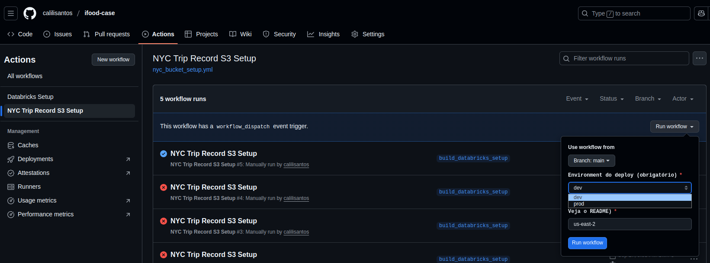
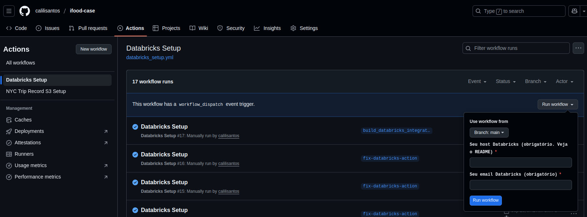
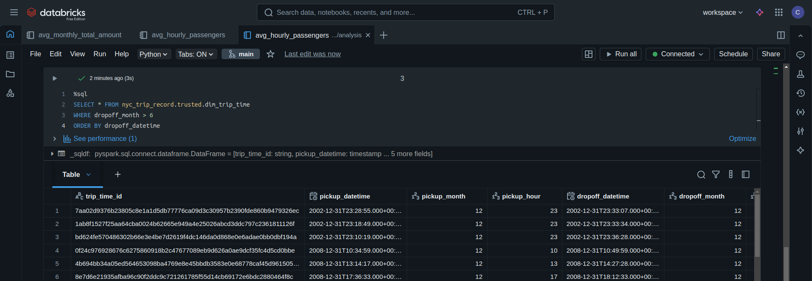
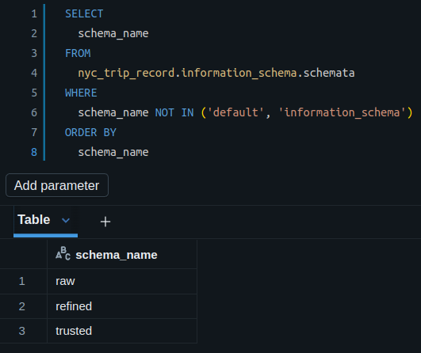

# Boas vindas ao **NYC Trip Record!**

Para executar o projeto, observe as orientações descritas a seguir, e se tiver qualquer dúvida, sugestão, contribuição, considere abrir uma issue ou entrar em contato. 🚀

Aqui você vai encontrar os detalhes de como está estruturado e foi desenvolvido o projeto.

# <a id='topicos'>Tópicos</a>
- [Desenvolvimento](#desenvolvimento)
  - [Objetivo](#objetivo)
  - [Estrutura do projeto](#estrutura)
  - [Tecnologias utilizadas](#tecnologias)
- [Orientações](#orientacoes)
  - [Executando o projeto](#execucao)
    - [Requisitos](#requisitos)
    - [Configurações Necessárias](#settings)
    - [Executando Setup](#setup)
    - [Configurando External Location](#external)
    - [Executando Jobs Databricks](#jobs)
- [Implementações](#implementacoes)
  - [Contextualizando](#contextualizando)
  - [Continuous Delivery](#ci)
    - [NYC Bucket Setup](#bs)
    - [Databricks Setup](#db)
  - [Camada de Consumo](#cl)
    - [Desenho do ambiente](#layers)
    - [Modelagem de Dados](#der)
  - [Tagueamento do ambiente](#tags)
  - [DataOps](#dataops)
- [Decisões Arquiteturais](#adr)
  - [Definições de Solução](#c4-model)
  - [Registros de Decisão](#registros)
- [Próximos passos](#next)

# <a id='desenvolvimento'>[Desenvolvimento](#topicos)</a>

<strong><a id='objetivo'>[Objetivo](#topicos)</a></strong>

  O **objetivo** é construir um ambiente de desenvolvimento de um datalake com os dados da Taxi & Limousine Comission (TLC) da cidade de Nova York, disponíveis [aqui](https://www.nyc.gov/site/tlc/about/tlc-trip-record-data.page). Em um primeiro recorte, com o sample de Janeiro a Maio de 2023.
  
  Para isso, foi definida uma [**arquitetura de referência**](#c4-model) e [**modelagem dos dados**](#der) tornando a disponibilidade e consumo do ambiente analítico escalável e resiliente.

  ---

<strong><a id='estrutura'>[Estrutura do projeto](#topicos)</a></strong>

* **Na pasta [.github](.github) estão os diretórios:**
  * **[actions](.github\actions)** com custom actions do `GitHub Actions`, modularizando e desaclopando steps dos workflows de subida dos componentes da arquitetura de referência;
  * **[workflows](.github\workflows)** com os workflows `GitHub Actions` que iniciam o setup das duas soluções adotadas para construção do datalake para o projeto:
    * **[databricks_setup](.github\workflows\databricks_setup.yml)** que adiciona as secrets, esse repositório e cria no ambiente Databricks informado, os jobs de ingestão e transformação de dados da TLC;
    * **[nyc_bucket_setup](.github\workflows\nyc_bucket_setup.yml)** que cria um bucket S3 no console AWS informado, para storage do datalake pavimentado pelo Databricks;
* **Na pasta [analysis](analysis) estão os arquivos que endereçam questões de negócio sobre os dados do TLC NYC**;
* **Na pasta [devops](devops) estão os módulos utilizados pelos workflows `GitHub Actions`** para pavimentação do Databricks e S3 (baseado em Terraform);
* **Na pasta [src](src) estão os diretórios:**
  * **[dataops](src\dataops)** com os códigos fonte utilizados para as operações do ambiente analítico, atualmente no processamento de dados específicos da origem que não puderam seguir o fluxo normal. Mais sobre o tema [aqui](#registros);
  * **[ingestion](src\ingestion)** com os códigos fonte do job de ingestão dos dados do TLC para a camada bruta (raw) de processamento;
  * **[transform](src\transform)** com os códigos fonte do job de transformações dos dados brutos e pouso nas camadas de consumo dos times de análise (refined e trusted);

  ---

<strong><a id='tecnologias'>[Tecnologias utilizadas](#topicos)</a></strong>

  O projeto foi desenvolvido utilizando o AWS S3 como solução de armazenamento dos dados, e o Databricks Free Edition como solução para aquisição, processamento e consumo (serving) no ambiente analítico.

  Para provisionamento do código, o `Github Actions` foi a solução utilizada para entrega e integração contínua da infraestrutura e desenvolvimento do ambiente. E o `Terraform` foi a opção empregada para versionamento e deploy da infraestrutura integral do S3.

  Ainda sobre o processamento dos dados, o `Python` foi utilizado como API principal, e as bibliotecas e engines utilizadas através do Databricks, baseadas no Python, foram as abaixo:

  * **[boto3](https://boto3.amazonaws.com/v1/documentation/api/latest/reference/services/s3.html):** Kit de desenvolvimento (SDK) da AWS que habilita via código ter uma interface programática com os recursos da cloud. Aqui utilizada como solução de aquisição de dados, consumindo da origem e copiando para o storage.
  * **[PySpark](https://spark.apache.org/docs/latest/api/python/index.html):** API em python do `Apache Spark`, que habilita processamento de dados massivos (Big Data) utilizando a linguagem e também o SQL. 
  É também solução primária no Databricks, que opera via Cluster Jobs do Spark toda a carga e recursos de rede que utiliza.

  ---

# <a id='orientacoes'>[Orientações](#topicos)</a>

<strong><a id='execucao'>[Executando o projeto](#topicos)</a></strong>

  O projeto foi pensado para ser reproduzível com uma conta na AWS e Databricks Free Edition. Detalhes da escolha das soluções [aqui](#adr)

  Importante seguir o passo a passo abaixo para execução dele

### <strong><a id='requisitos'>[1. Requisitos:](#topicos)</a></strong>

>**IMPORTANTE** Observe os padrões de nomes dos recursos e credenciais, para integração e funcionamento correto do código e ambientes utilizados.

* Fazer fork desse projeto em sua conta Github
* Conta AWS
* Conta Databricks Free Edition

### <strong><a id='settings'>[2. Configurações necessárias:](#topicos)</a></strong>

* Parâmetros/Credenciais a criar:
  * AWS Console:
    * Access Key (Chave de Acesso). Tutorial [aqui](https://docs.aws.amazon.com/keyspaces/latest/devguide/create.keypair.html).
    * Instance Provider (Provedor de Instância) para integração AWS <> GitHub Actions

      
        
        
<strong>Passo a passo</strong>
 

        * Criar OIDC (OpenID Connect):
          * Referência [aqui](https://aws.amazon.com/pt/blogs/security/use-iam-roles-to-connect-github-actions-to-actions-in-aws/)
          * Necessário:
            * Informar nome do seu perfil no campo `Github Organization` , na criação da função (role) do OIDC, conforme a referência acima (Step 2);
            * Coloque `NycTripRecordOidcRole` como nome da role na criação da função (role) do OIDC, conforme a referência acima (Step 2);
            * Selecione a role: `AmazonS3FullAccess` na criação da função (role) do OIDC, conforme a referência acima (Step 2);
          * Recomendado:
            * Informar url do repositório que foi feito o fork, na criação da função (role) do OIDC, conforme a referência acima
            * Colocar tags desse projeto;
            * Especificar branch do repositório que foi feito o fork, na criação da função (role) do OIDC, conforme a referência acima
        * Adicionar `ARN` do Identity Provider criado nas variáveis do repositório criado
          * No seu repositório acesse:
            * Aba `Settings` 
            * Na seção `Security`, clique em `Secrets and variables` 
            *Clique em `Actions` 
            * Na sequência, clique na aba `Variables` 
            * Crie uma variável com o nome `NYC_TRIP_RECORD_OIDC_ARN`, com o valor do ARN do Identity Provider criado
            * Crie uma variável com o nome `NYC_TRIP_RECORD_AWS_REGION` com o valor us-east-2
          * **IMPORTANTE:** os nomes acima e a criação dessas variáveis é necessário para deploy do S3 que utiliza essas configurações
          * Role para o Instance Provider com o nome `NycTripRecordOidcRole` 
            > IMPORTANTE: É necessário usar esse nome para funcionamento da criação do S3
        
        ---

        

  * Databricks:
    * Personal Access Token (PAT) do Databricks. Tutorial [aqui](https://docs.databricks.com/aws/pt/dev-tools/auth/pat#databricks-acesso-pessoal-para-usu%C3%A1rios-tokens-workspace)
  * Github:
    * Repository Secrets: (Tutorial [aqui](https://docs.github.com/pt/actions/how-tos/write-workflows/choose-what-workflows-do/use-secrets#creating-secrets-for-a-repository))
      * AWS_ACCESS_KEY_ID: Com esse nome, e valor da access key da AWS criada
      * AWS_SECRET_ACCESS_KEY: Com esse nome, e valor da access key secret da AWS criada
      * DATABRICKS_TOKEN: Com esse nome, e valor do PAT Databricks
      * NYC_TRIP_RECORD_OIDC_ROLE_ARN: Com esse nome, e valor do ARN da Role do Instance Provider criada

### <strong><a id='setup'>[3. Executando Setup:](#topicos)</a></strong>

A criação do ambiente é executada com o Github Actions, dividida em dois fluxos:

- Setup S3 (criação do bucket e diretórios das camadas de processamento)
- Setup Databricks (criação das secrets AWS no Databricks, clone do repositório e criação dos jobs na workspace)

Foi definida a execução manual dos workflows pensando na segurança e resiliência dos ambientes, com a evolução dos recursos feita pós setup 

Parâmetros a informar na execução dos workflows:

  * Workflow Databricks Setup:
    * **databricks_host**: Url do Databricks antes do parâmetro "?o=<número_workspace>
      * Ex: url: 
        * https://dbc-ab3dba61-89cc.cloud.databricks.com/?o=3912183202474156; 
        * databricks_host: https://dbc-ab3dba61-89cc.cloud.databricks.com/
    * **databricks_user_email**: Seu email utilizado para login no Workspace Databricks
  * Workflow NYC Trip Record S3 Setup:
    * **environment**: Com os valores 'dev' ou 'prod' (a ser implementado)
    * **aws_region**: Com o valor da região a criar o bucket S3
      > IMPORTANTE: Para a versão free do Databricks, usar a região us-east-2 para funcionamento da integração AWS <> Databricks

### <strong><a id='external'>[4. Configurando External Location via Databricks GUI](#topicos)</a></strong>

Para o Databricks Free Edition a criação da external location e storage credential, que permitem a conexão do Databricks com o Bucket S3, só foi possível utilizando o AWS CloudFormation Quickstart.

Siga [esse tutorial](https://docs.databricks.com/aws/en/connect/unity-catalog/cloud-storage/s3/s3-external-location-cfn#step-1-create-an-external-location-for-an-s3-bucket-using-an-aws-cloudformation-template) antes de sequenciar as demais etapas de execução do projeto.

>IMPORTANTE: No setup do AWS Quickstart, utilize essa url como caminho do seu bucket: `s3://nyc-trip-record-ifood/`

>IMPORTANTE: É possível que o nome do bucket usado nesse projeto esteja em uso durante sua execução. Nesse cenário, modifique o nome do bucket utilizado nesses arquivos e na url apresentada anteriormente:
* nome atual: nyc-trip-record-ifood
* devops/terraform/_variables.tf
* src/ingestion/ingestion.py

### <strong><a id='jobs'>[5. Executando Jobs Databricks:](#topicos)</a></strong>

Após execução dos workflows de setup, os jobs abaixo devem aparecer na workspace Databricks informada.

Para construção da camada de consumo de dados, execute eles nessa sequência: (Como executar um job Databricks [aqui](https://docs.databricks.com/aws/pt/jobs/run-now#with-different-params))

* **nyc_trip_record_ingestion**: faz a cópia dos dados do TLC NYC, para a camada bruta do bucket S3 dedicado
  * parâmetros a informar:
    * car_type:
      * para mais de um separar nomes por vírgula sem espaços. 
        * Ex: yellow,green    
      * valores possíveis:
        * yellow
        * green
        * fhv
        * fhvhv
        * all (para buscar dados de todos os tipos)
    * years
      * para mais de um separar nomes por vírgula sem espaços. 
      * Ex: 2023,2024
    * months:  
      * para mais de um, seguir o padrão <mês de início>-<mês final>. 
        * ex: janeiro a maio: 1-5

* **nyc_trip_record_refined_load**: faz a carga dos dados ingeridos na raw para a camada refined, tendo como escopo:
  * Selecionar colunas necessárias para a camada trusted
  * Deduplicar os dados

* **Reparo da carga de Janeiro de 2023**: Antes de executar a ingestão trusted, faça o reparo previsto [aqui](#dataops).

* **nyc_trip_record_trusted_load**: faz a carga dos dados da camada silver para a camada trusted, atualizando a tabela fato, e recriando as dimensões. Detalhes da modelagem dimensional [aqui](#der)

Definiu-se a execução manual dos jobs considerando economia dos recursos em cloud e a idéia de simular ambiente de desenvolvimento com o projeto.

Como débito técnico, a implementação de CDC será construída para as camadas refined e trusted.

  ---

# <a id='implementacoes'>[Implementações](#topicos)</a>

<strong><a id='contextualizando'>[Contextualizando](#topicos)</a></strong>

Os dados da origem são arquivos parquet com o registro de corridas mensal das empresas de taxi e serviços de plataforma (Uber, Lift, ...) na cidade de Nova York.

Foi sugestão da solicitante o uso da AWS para storage dos dados processados, e Databricks para construção das camadas de processamento. 

Os requisitos levantados foram: 
* O período de Janeiro a Maio de 2023 para piloto do ambiente;
* A disponibilização das colunas abaixo na camada de consumo:
  * **VendorID**
  * **passenger_count** 
  * **total_amount**
  * **tpep_pickup_datetime** 
  * **tpep_dropoff_datetime**

* O direcionamento das seguintes perguntas sobre o negócio:
  * Qual a média de passageiros (passenger\_count) por cada hora do dia que pegaram táxi no mês de maio considerando todos os táxis da frota?
  * Qual a média de valor total (total\_amount) recebido em um mês considerando todos os yellow táxis da frota?

O funcionamento do projeto é apresentado abaixo:

<strong><a id='ci'>[Continuous Delivery](#topicos)</a></strong>

O Setup do ambiente foi pensado para automatizar a replicação do ambiente e prova de valor do projeto.

Dois workflows Github Actions compõem o fluxo de entrega:

<strong><a id='bs'>[NYC Bucket Setup](#topicos)</a></strong>

Para [execução do setup do S3](#setup), essa interface do GitHub Actions foi implementada.

**Imagem 01 - Execução de Setup do S3.**

<strong><a id='db'>[Databricks Setup](#topicos)</a></strong>

Para [execução do setup do Databricks](#setup), essa interface do GitHub Actions foi implementada.

**Imagem 02 - Execução de Setup do Databricks.**

<strong><a id='cl'>[Camada de Consumo](#topicos)</a></strong>

A camada de consumo definida foi o Databricks, onde a exploração do código fonte e desenvolvimento à partir do lake é disponibilizada utilizando python, SQL e Spark.

**Imagem 03 - Consumindo camada trusted com Databricks.**

<strong><a id='layers'>[Desenho do ambiente](#topicos)</a></strong>

Buscando o tracking e segregação do consumo dos dados, o processamento dos dados foi definido utilizando as seguintes camadas:
* Catálogo: nyc_trip_record
* raw
* refined
* trusted

**Imagem 04 - Camadas de processamento no Databricks.**

Com os diferentes níveis de acurácia, à partir da camada refined é possivel gerar visões de negócio com base nos requisitos levantados.

E a camada trusted traz a consolidação dos dados para criação de produtos de dados e insights refinados sobre as bases

<strong><a id='der'>[Modelagem de Dados](#topicos)</a></strong>

A camada raw traz os dados como na origem (as-is), seguindo o schema original dos dados

A camada refined atualmente só apresenta os dados de taxis (yellow e green taxi) dada a [demanda de negócio](#contextualizando) focada nesses veículos, representados no diagrama abaixo

**Imagem 05 - Diagrama Camada Refined.**

Por fim, a camada trusted persiste os dados seguindo o modelo dimensional, apresentado na imagem 06.

**Imagem 06 - Diagrama Camada Trusted.**

Detalhamento das dimensões abaixo:

### Tabela dim_trip_time:
|Coluna|Tipo|Descrição|
|-|-|-|
|trip_time_id|STRING|Surrougate Key concatenando pickup_datetime e dropoff_datetime|
|pickup_datetime|TIMESTAMP|Timestamp do começo da corrida. Concentrando tpep_pickup_datetime e lpep_pickup_datetime dos dados brutos|
|pickup_month|INTEGER|Mês do começo da corrida|
|pickup_hour|INTEGER|Hora do começo da corrida|
|dropoff_datetime|TIMESTAMP|Timestamp do fim da corrida. Concentrando tpep_dropoff_datetime e lpep_dropoff_datetime dos dados brutos|
|dropoff_month|INTEGER|Mês do fim da corrida|
|dropoff_hour|INTEGER|Hora do fim da corrida|
### Tabela dim_vendor:
|Coluna|Tipo|Descrição|
|-|-|-|
|vendor_id|STRING|Surrougate Key concatenando vendor_code, vendor_name e car_type|
|vendor_code|BIGINT|VendorID dos dados brutos|
|vendor_name|STRING|Nome do vendo com base no dicionário de dados|
|car_type|STRING|Tipo do carro (yellow, green, fhv, fhvhv)|
### Tabela fact_trip:
|Coluna|Tipo|Descrição|
|-|-|-|
|fact_id|STRING|Surrougate Key concatenando vendor_id, pickup_datetime, dropoff_datetime, total_amount e passenger_count|
|vendor_id|STRING|da dim_vendor|
|trip_time_id|STRING|da dim_trip_time|
|passenger_count|LONG|Quantidade de passageiros da corrida|
|total_amount|DOUBLE|Valor pago por corrida|

<strong><a id='tags'>[Tagueamento do ambiente](#topicos)</a></strong>

Buscando a governança e monitoria do ambiente, os recursos provisionados nascem com as seguintes tags:

* component: setup | data_integration
* cost_center: nyc_trip_record
* developer: calilisantos@gmail.com
* env: dev
* resource: 
    nyc_trip_record_oidc
    nyc_trip_record_oidc_role
    nyc_trip_record_bucket
    nyc_trip_record_ingestion_job
    nyc_trip_record_refined_load_job
    nyc_trip_record_trusted_load_job

<strong><a id='dataops'>[DataOps](#topicos)</a></strong>

Para consolidar as operações do ambiente analítico, foi feita uma camada staging no bucket, nesse primeiro momento para reparo da ingestão dos arquivos de Janeiro de 2023 da base de dados que apresentava inconsistência de schema.

O código de reparo está presente [aqui](src\dataops\fix_load.py), com a subida feita de forma manual dos arquivos desse período para os taxis green e yellow, com sua carga feita diretamente para a camada refined.

  ---

# <a id='adr'>[Decisões Arquiteturais](#topicos)</a>

<strong><a id='c4-model'>[EM CONSTRUÇÃO - Definições de Solução](#topicos)</a></strong>

Para definições de arquitetura, escolheu-se o C4-Model como referência de modelagem da solução, e a utilização de registros de arquitetura (ADR) para gestão do conhecimento, utilizando o template MADR. 

<strong><a id='registros'>[Registros de Decisão](#topicos)</a></strong>

* Arquitetura de Referência
  * Inicialmente levantou-se como cenário ideal segregar ingestão e processamento dos dados do Databricks, segregando responsabilidades e aproveitando features nativas da cloud para aquisição de dados com algumas soluções levantadas (ver esboços [aqui](docs\drafts.excalidraw) e [aqui](docs\project.archimate))
    * Ingestão: 
      * AWS Lambda + EventBridge
      * AWS Step Functions + Glue Job
      * AWS EC2 com Airflow
      * Airflow Gerenciado da AWS (MWAA)
  * Com as limitações de configurar o ambiente Databricks Free Edition, e baixa volumetria do sample estabelecido inicialmente, foi definido o uso do boto3 junto com o Databricks para aquisição de dados, decisão a ser reconsiderada em ambiente produtivo e evolução do projeto
* Configurar conexão AWS<>Databricks Free Edition 
  * Limitações: Instance profile precisa de databricks provisionado na AWS: https://docs.databricks.com/aws/pt/connect/storage/tutorial-s3-instance-profile
  * Storage credential e external location tem restrições tambem. Criação delas foi feita com sucesso através do AWS Quickstart (que utiliza CloudFormation)
  * Decisão: criar access_key e access_secret_key no Console AWS e colocar em secrets github
* Feature de Documentação das tabelas com DBRX (Hub de Agentes do Databricks):
  * Acesso de construção do modelo não é permitida com Databricks Free Edition, postergando feature no momento

  ---

# <a id='next'>[Próximos passos](#topicos)</a>

* Rever débitos técnicos:
  * Construção de estratégia de CDC
    * Tabela de parâmetros, tornando ingestões dinâmicas (flag para ingerir ou não)
  * Acoplamento de ingestão e transformação no Databricks
* Evoluções:
  * Construção de solução de Data Quality para lidar com inconsistências dos dados
    * Schema dos campos (passenger_count como double em Janeiro de 2023)
    * Dados out-of-sample (2002, 2008, 2014, etc...)
    * Outliers dos valores
  * Utilizar dicionário de dados da origem para documentação das tabelas
  * Testes de integração, unitários
  * Modularizar código com strategy e factory patterns
  